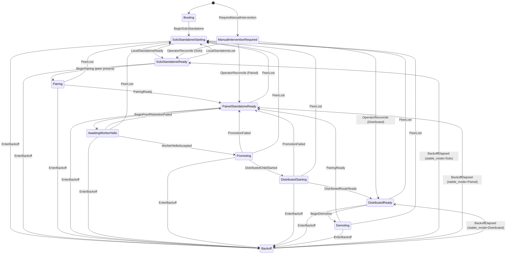

# siderostat 接続状態機械（実装に基づく現行仕様）

> 本稿は `docs/spec.md` の target behavior と、現行実装（`src/cluster/state.rs`、
> `src/cluster/runtime.rs`、`src/cluster/control.rs`、`src/cluster/production/*`）を突き合わせて、
> **実装が実際に行っている** cluster / peer 接続状態を状態機械として記述する。
> 文書の位置づけは「現状把握用の正本」であり、`docs/spec.md`（target）や
> `docs/archive/implementation-plan-v0.1.0.md`（完了済み刷新計画の履歴）を置き換えるものではない。
> 最終更新日: 2026-08-14

## 1. この文書で扱う範囲

- 単一 process 内の cluster state machine（`ClusterState` / `StableMode` / `ProxyTarget`）。
- Peer 間の control plane（HMAC 認証、lease、pairing handshake）。
- Paired Standalone 形成、MXFP4 Distributed への promotion / demotion。
- Peer 喪失からの復帰（re-pair）経路。
- 永続 state と backoff / manual intervention。

HTTP reverse proxy の詳細（header、retry、admission、drain）は `docs/spec.md` を参照し、
ここでは cluster 状態遷移に必要な範囲だけを扱う。

## 2. 用語（本稿限定）

| 用語 | 意味 |
|---|---|
| cluster 世代 (generation) | `ClusterSnapshot.generation`。状態機械の遷移ごとに +1 される単調増加整数。イベントの `expected_generation` 照合に使う |
| control 世代 | `ControlProcessor.local.generation`。control メッセージの `generation` 欄。cluster 世代とは**別カウンタ** |
| 自ノード descriptor | `ProductionInner.descriptor`。起動時に一度だけ構築され、`generation` は以後更新されない（0 相当の初期値） |
| peer lease | `PeerLease`。相手から受信した認証済み descriptor と期限付き有効性（route_scoped / stability / expires_at） |
| required_peer_stability | 既定 5 秒。認証開始から peer present と判定するまでに必要な継続時間 |
| control lease | 既定 15 秒。renew なしで peer present を維持できる上限 |

## 3. 状態の定義

### 3.1 StableMode（安定モード）

```rust
enum StableMode {
    SoloStandalone,     // 単独スタンドアローン
    PairedStandalone,   // ペア済みスタンドアローン（coordinator へ集約）
    DistributedMxfp4,   // 分散 MXFP4（pipeline parallel）
}
```

### 3.2 ClusterState（状態機械の状態）

```rust
enum ClusterState {
    Booting,
    SoloStandaloneStarting,
    SoloStandaloneReady,
    Pairing,
    PairedStandaloneReady,
    AwaitingWorkerHello,
    Promoting,
    DistributedStarting,
    DistributedReady,
    Demoting,
    Backoff,
    ManualInterventionRequired,
}
```

### 3.3 ProxyTarget（転送先）

```rust
enum ProxyTarget {
    LocalStandalone,                          // 自ノードの standalone upstream
    Coordinator,                              // coordinator の peer ingress
    Unavailable { reason: UnavailableReason },// 遷移中 / 起動中 / 停止中
}
```

`resolve_target(role, stable_mode, state, local_standalone_ready)` で一意に決まる
（spec 第 9.2 節）。

## 4. 状態遷移図

### 4.1 全体像（mermaid）



### 4.2 遷移一覧（state.rs `transition()` の実装通り）

| 現在状態 | イベント | 次状態 | StableMode | local_ready の変化 |
|---|---|---|---|---|
| Booting / Backoff | BeginSoloStandalone | SoloStandaloneStarting | Solo | false に固定 |
| SoloStandaloneStarting | LocalStandaloneReady | SoloStandaloneReady | Solo | true |
| SoloStandaloneReady | LocalStandaloneLost | SoloStandaloneStarting | Solo | false |
| SoloStandaloneReady | BeginPairing | Pairing | Solo | 現状維持 |
| Pairing | PairingReady | PairedStandaloneReady | Paired | Worker のみ false |
| PairedStandaloneReady | BeginPromotion | AwaitingWorkerHello | Paired | 現状維持 |
| AwaitingWorkerHello | WorkerHelloAccepted | Promoting | Paired | 現状維持 |
| Promoting | DistributedChildStarted | DistributedStarting | Paired | false |
| DistributedStarting | DistributedRouteReady | DistributedReady | Distributed | Worker のみ false |
| AwaitingWorkerHello / Promoting / DistributedStarting | PromotionFailed | PairedStandaloneReady | Paired | Worker のみ false |
| DistributedReady | BeginDemotion | Demoting | Distributed | false |
| Demoting | PairingReady | PairedStandaloneReady | Paired | Worker のみ false |
| Pairing / PairedStandaloneReady / AwaitingWorkerHello / Promoting / DistributedStarting / DistributedReady / Demoting | PeerLost | SoloStandaloneStarting | Solo | false |
| 任意状態 | EnterBackoff | Backoff | 現行 stable_mode | 現状維持 |
| Backoff | BackoffElapsed | 各 stable_mode の ready 状態 | 現行 stable_mode | 現状維持 |
| ManualInterventionRequired | OperatorReconcile | 各 stable_mode の ready 状態 | 現行 stable_mode | 現状維持 |
| 任意状態 | RequireManualIntervention | ManualInterventionRequired | 現行 stable_mode | 現状維持 |

## 5. イベント（ClusterEventKind）

```rust
enum ClusterEventKind {
    BeginSoloStandalone,
    LocalStandaloneReady,
    LocalStandaloneLost,
    BeginPairing,
    PairingReady,
    WorkerHelloAccepted,
    BeginPromotion,
    DistributedChildStarted,
    DistributedRouteReady,
    PromotionFailed,
    BeginDemotion,
    PeerLost,
    EnterBackoff,
    BackoffElapsed,
    RequireManualIntervention,
    OperatorReconcile,
}
```

各イベントは `expected_generation` を持ち、現在の `ClusterSnapshot.generation` と一致しないと
`StaleGeneration` で拒否される。単一 writer タスクが直列処理する（`spawn_state_machine`）。
遷移成功時のみ generation が +1 され、watch channel で購読者へ通知される。

## 6. Peer presence と lease

### 6.1 peer present の判定条件（`PeerLease::peer_present`）

`PeerLease` が次を**すべて**満たすときだけ peer present とする。

1. `route_scoped == true`（`bridge0` scoped route がある）
2. `descriptor.is_some()`（認証済み descriptor を受信済み）
3. 安定条件: `now >= first_authenticated_at + required_peer_stability`
4. lease 未失効: `now < expires_at`

`invalidate_route()` は `route_scoped` だけを false にする（descriptor と generation は保持）。

### 6.2 establish / renew

- `establish`：`Pair` を受信したときに呼ばれる。`same_membership`（同一 generation・同一
  node_id・未失効）なら `first_authenticated_at` を保持し、そうでなければ再設定。
- `renew`：`Pair` 以外の control メッセージ、または `GET /v1/node` 時に呼ばれる。
  descriptor 一致かつ未失効なら `expires_at` を延長。
- `advance_generation(generation)`：受信 `Pair` の generation が自 local generation より大きい
  ときだけ呼ばれ、local generation・lease generation・descriptor generation を更新し、
  `processed`（冪等性 map）をクリアする。

### 6.3 双方向 lease の維持

両 node が `start_reconcile_task` を持ち、周期 = `min(reconcile_interval, control_lease/3)`（既定
`min(30s, 5s)=5s`）で相手へ `GET /v1/node` を送る。この `node()` が相手側の `descriptor_response`
→ `renew` を呼ぶため、**双方向の lease は相互の node() 呼び出しで維持される**。

## 7. Pairing ハンドシェイク（初回と再確立）

Pairing は **coordinator 起点のみ**（`pair()` 冒頭の `ensure!(role == Coordinator)`）。
worker 側の `pair()` は即 bail する。

```text
coordinator                      worker
    |  POST /v1/pair (gen=G)        |
    |----------------------------->|  WorkerControl::handle
    |                               |    lease.establish (worker側)
    |                               |    apply_effect(Pair):
    |                               |      POST /v1/pair を返信
    |  <-----------------------------|      (worker も lease.establish)
    |  CoordinatorControl::handle    |
    |    lease.establish (coord側)   |
    |  apply_effect(Pair):           |
    |    sleep(required_peer_stability)
    |    reconcile_peer()            |
    |  reconcile_peer():             |
    |    peer_present -> BeginPairing
    |    -> Pairing -> PairingReady
```

- 送信側の `pair()` が使う generation は `control_generation()`：
  `peer_lease().descriptor().map_or(inner.descriptor.generation, |d| d.generation)`。
- 受信側 `handle_validated` は `Pair` かつ `message.generation > local.generation` のときだけ
  `advance_generation` し、`message.generation != local.generation` なら
  `GenerationMismatch` で拒否する。

## 8. モード遷移の実行（role 別の副作用）

### 8.1 form_pair（SoloStandaloneReady + peer present → PairedStandaloneReady）

`ModeRuntime::form_pair`：

- coordinator：`BeginPairing` → 自 proxy admission を block → `PairingReady` → serving。
- worker：`BeginPairing` → 自 proxy admission を **drain** → local standalone child を **stop**
  → `PairingReady` → serving。以後 worker は coordinator peer ingress へ転送。

### 8.2 fallback_to_solo（peer 喪失 → SoloStandaloneStarting → Ready）

`ModeRuntime::fallback_to_solo`：

- 全 role 共通：admission block → `PeerLost` → SoloStandaloneStarting。
- worker：local standalone child を **start**。
- `LocalStandaloneReady` で SoloStandaloneReady に戻り serving。

### 8.3 promotion（coordinator）

`promote()`：`BeginPromotion` → AwaitingWorkerHello → `prepare_and_accept_hello`
（worker へ PrepareWorker、rendezvous listener で実 DS4 HELLO 受信）→ `WorkerHelloAccepted`
→ Promoting → `promote_validated`（peer drain + local drain → standalone stop → coordinator
child start → `DistributedChildStarted` → DistributedStarting → complete route 確認 →
`DistributedRouteReady` → DistributedReady）。

### 8.4 promotion（worker）

`prepare_worker()`（coordinator から PrepareWorker を受けた worker）：`BeginPromotion` →
AwaitingWorkerHello → `worker.prepare`（drain → standalone stop → worker child start）→
`WorkerHelloAccepted` → Promoting → `DistributedChildStarted` → DistributedStarting →
`DistributedRouteReady` → DistributedReady → coordinator へ `WorkerEvent(Ready)` 送信。

### 8.5 demotion

`demote()`：`BeginDemotion` → Demoting → drain → coordinator child stop → worker stop →
standalone start → `PairingReady` → PairedStandaloneReady。

## 9. Backoff / ManualIntervention

- Promotion 失敗（同一 `ClusterFailure` で連続）は `PromotionFailureTracker` が集計する。
- 連続回数 < `max_consecutive_promotion_failures`（既定 3）なら `EnterBackoff` → Backoff へ。
- 連続回数 >= 上限なら `RequireManualIntervention` → ManualInterventionRequired へ。
- Backoff は `reconcile_backoff`（既定 300s 後）で `BackoffElapsed` → 現行 stable_mode の ready 状態へ。
- ManualInterventionRequired は `OperatorReconcile` でのみ復帰。
- 注意: promotion 失敗から `PromotionFailed` で PairedStandaloneReady へ戻す recovery と、
  backoff/manual への遷移は別系統。

## 10. 永続 state

`StateStore` は cluster lifecycle を JSON で保存する（`desired_mode` / `last_stable_mode` /
`cluster_state` / `proxy_target` / child identity / generation）。atomic rename、file lock、
corrupt 時は保全。Secret/token は保存しない。

## 11. 実装と仕様の対応（既知の差分）

| 観点 | spec の記述 | 実装の状況 |
|---|---|---|
| 状態集合 | `Booting`〜`ManualInterventionRequired` | state.rs の `ClusterState` と一致 |
| Peer present 条件 | 5 条件（route/HMAC/lease/stability 等） | `PeerLease::peer_present` で 4 条件を判定（Bonjour 発見は discovery 層で別扱い） |
| Pairing | coordinator 起点 | `pair()` は coordinator のみ（worker は bail） |
| 世代 | transition の idempotency | cluster 世代は遷移ごとに +1。control 世代は別管理 |
| 再pair | 「reconnect/backoff 後 Paired Standalone、次いで MXFP4 再昇格」（spec 32.5） | 統合テストは promote/demote の往復のみ。peer 喪失→solo→再pair の自動経路はテストされていない |

## 12. 付録: 主要ソース位置

| 関心 | ファイル |
|---|---|
| 状態機械の定義・遷移 | `src/cluster/state.rs` |
| 状態機械の実行・peer reconcile | `src/cluster/runtime.rs` |
| control プロトコル・lease | `src/cluster/control.rs` |
| coordinator 側 control | `src/cluster/coordinator/control.rs` |
| worker 側 control | `src/cluster/worker.rs` |
| production 全体（pair/promote/demote） | `src/cluster/production.rs` ほか `production/{pairing,reconcile,worker,effects}.rs` |
| network イベント監視 | `src/cluster/network_events.rs` |
| Thunderbolt IP state | `src/cluster/network_snapshot.rs` |
| child 監視 | `src/cluster/process/*.rs` |
