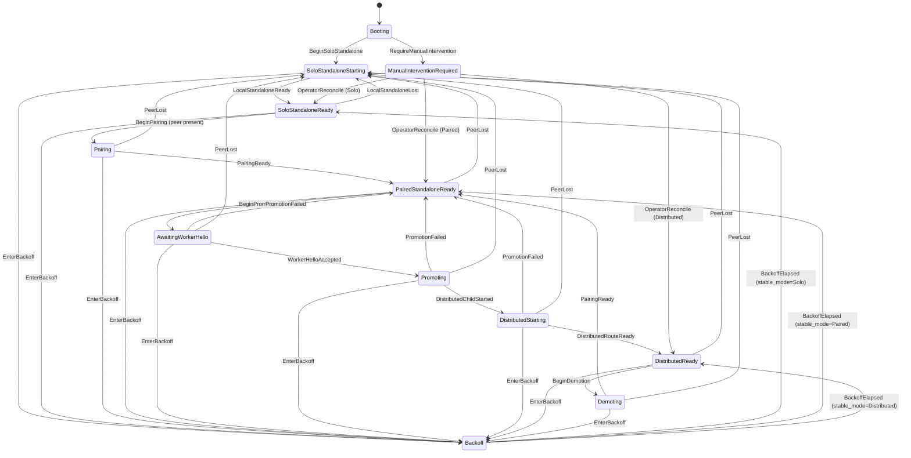

# siderostat 接続状態機械（実装に基づく現行仕様）

> 本稿は `docs/spec.md` の target behavior と、現行実装（`src/cluster/state.rs`、
> `src/cluster/runtime.rs`、`src/cluster/control.rs`、`src/cluster/production/*`）を突き合わせて、
> cluster / peer 接続状態を記述する。純粋な状態遷移だけでなく、その遷移を起こす
> production orchestration と child lifecycle の配線も区別して扱う。
> 文書の位置づけは「現状把握用の正本」であり、`docs/spec.md`（target）や
> `docs/archive/implementation-plan-v0.1.0.md`（完了済み刷新計画の履歴）を置き換えるものではない。
> 最終更新日: 2026-08-17

## 1. この文書で扱う範囲

- 単一 process 内の cluster state machine（`ClusterState` / `StableMode` / `ProxyTarget`）。
- Peer 間の control plane（HMAC 認証、lease、pairing handshake）。
- Paired Standalone 形成、Distributed (layer-parallel) への promotion / demotion。MXFP4はmodel quantizationとして別管理する。
- Peer 喪失からの復帰（re-pair）経路。
- 永続 state と backoff / manual intervention。

HTTP reverse proxy の詳細（header、retry、admission、drain）は `docs/spec.md` を参照し、
ここでは cluster 状態遷移に必要な範囲だけを扱う。

本稿では次の 3 層を区別する。

1. **transition reducer**：`state.rs::transition()` が許可する状態とイベントの組。
2. **mode / child lifecycle**：`ModeRuntime`、`CoordinatorDistributedRuntime`、
   `WorkerDistributedRuntime` が admission と child process を操作する経路。
3. **production wiring**：control HTTP、periodic reconcile、永続 state、network event が
   上記を実際に呼び出す配線。

遷移が reducer 上で許可されることは、必要な child 操作や timer が production に配線済みで
あることを意味しない。

## 2. 用語（本稿限定）

| 用語 | 意味 |
|---|---|
| cluster 世代 (generation) | `ClusterSnapshot.generation`。状態機械の遷移ごとに +1 される単調増加整数。イベントの `expected_generation` 照合に使う |
| control 世代 | `ControlProcessor.local.generation`。control メッセージの `generation` 欄。cluster 世代とは**別カウンタ** |
| 自ノード descriptor | `ProductionInner.descriptor`。起動時に `mode.snapshot().generation` から一度だけ構築され、以後更新されない。再起動時は永続 generation を継承した起動遷移後の値であり、通常 0 ではない |
| peer lease | `PeerLease`。相手から受信した認証済み descriptor と期限付き有効性（route_scoped / stability / expires_at） |
| required_peer_stability | 既定 5 秒。認証開始から peer present と判定するまでに必要な継続時間 |
| control lease | 既定 15 秒。renew なしで peer present を維持できる上限 |
| recovery owner | `PeerLossRecovery`。control reconcile と route-loss monitor が共有する単一 owner。lock と完了 generation で PeerLost 復旧を直列化・冪等化する |
| network observation epoch | `NetworkSnapshot.epoch`。rescan の観測順序を表す単調値。古い snapshot は `NetworkEvidence` が拒否する |
| control session | `control_session_generation` と control phase / lease の組。cluster generation とは独立して永続化・再交渉する |

## 3. 状態の定義

### 3.1 StableMode（安定モード）

```rust
enum StableMode {
    SoloStandalone,     // 単独スタンドアローン
    PairedStandalone,   // ペア済みスタンドアローン（coordinator へ集約）
    DistributedMxfp4,   // 分散 MXFP4（pipeline parallel）
}
```

### 3.2 ClusterState（状態機械の状態）

```rust
enum ClusterState {
    Booting,
    SoloStandaloneStarting,
    SoloStandaloneReady,
    Pairing,
    PairedStandaloneReady,
    AwaitingWorkerHello,
    Promoting,
    DistributedStarting,
    DistributedReady,
    Demoting,
    Backoff,
    ManualInterventionRequired,
}
```

### 3.3 ProxyTarget（転送先）

```rust
enum ProxyTarget {
    LocalStandalone,                          // 自ノードの standalone upstream
    Coordinator,                              // coordinator の peer ingress
    Unavailable { reason: UnavailableReason },// 遷移中 / 起動中 / 停止中
}
```

`resolve_target(role, stable_mode, state, local_standalone_ready)` で一意に決まる
（spec 第 9.2 節）。

## 4. 状態遷移図

### 4.1 全体像（mermaid）



図の可読性のため、`EnterBackoff` と `RequireManualIntervention` の全辺は省略している。
reducer 上はいずれも**任意状態**から適用できる。`BeginSoloStandalone` は Booting に加えて
Backoff からも適用できる。正確な許可組は次の遷移一覧を正とする。

### 4.2 遷移一覧（state.rs `transition()` の実装通り）

| 現在状態 | イベント | 次状態 | StableMode | local_ready の変化 |
|---|---|---|---|---|
| Booting / Backoff | BeginSoloStandalone | SoloStandaloneStarting | Solo | false に固定 |
| SoloStandaloneStarting | LocalStandaloneReady | SoloStandaloneReady | Solo | true |
| SoloStandaloneReady | LocalStandaloneLost | SoloStandaloneStarting | Solo | false |
| SoloStandaloneReady | BeginPairing | Pairing | Solo | 現状維持 |
| Pairing | PairingReady | PairedStandaloneReady | Paired | Worker のみ false |
| PairedStandaloneReady | BeginPromotion | AwaitingWorkerHello | Paired | 現状維持 |
| AwaitingWorkerHello | WorkerHelloAccepted | Promoting | Paired | 現状維持 |
| Promoting | DistributedChildStarted | DistributedStarting | Paired | false |
| DistributedStarting | DistributedRouteReady | DistributedReady | Distributed | Worker のみ false |
| AwaitingWorkerHello / Promoting / DistributedStarting | PromotionFailed | PairedStandaloneReady | Paired | Worker のみ false |
| DistributedReady | BeginDemotion | Demoting | Distributed | false |
| Demoting | PairingReady | PairedStandaloneReady | Paired | Worker のみ false |
| Pairing / PairedStandaloneReady / AwaitingWorkerHello / Promoting / DistributedStarting / DistributedReady / Demoting | PeerLost | SoloStandaloneStarting | Solo | false |
| 任意状態 | EnterBackoff | Backoff | 現行 stable_mode | 現状維持 |
| Backoff | BackoffElapsed | 各 stable_mode の ready 状態 | 現行 stable_mode | 現状維持 |
| ManualInterventionRequired | OperatorReconcile | 各 stable_mode の ready 状態 | 現行 stable_mode | 現状維持 |
| 任意状態 | RequireManualIntervention | ManualInterventionRequired | 現行 stable_mode | 現状維持 |

## 5. イベント（ClusterEventKind）

```rust
enum ClusterEventKind {
    BeginSoloStandalone,
    LocalStandaloneReady,
    LocalStandaloneLost,
    BeginPairing,
    PairingReady,
    WorkerHelloAccepted,
    BeginPromotion,
    DistributedChildStarted,
    DistributedRouteReady,
    PromotionFailed,
    BeginDemotion,
    PeerLost,
    EnterBackoff,
    BackoffElapsed,
    RequireManualIntervention,
    OperatorReconcile,
}
```

各イベントは `expected_generation` を持ち、現在の `ClusterSnapshot.generation` と一致しないと
`StaleGeneration` で拒否される。単一 writer タスクが直列処理する（`spawn_state_machine`）。
遷移成功時のみ generation が +1 され、watch channel で購読者へ通知される。

## 6. Peer presence と lease

### 6.1 peer present の判定条件（`PeerLease::peer_present`）

`PeerLease` が次を**すべて**満たすときだけ peer present とする。

1. `route_scoped == true`（`bridge0` scoped route がある）
2. `descriptor.is_some()`（認証済み descriptor を受信済み）
3. 安定条件: `now >= first_authenticated_at + required_peer_stability`
4. lease 未失効: `now < expires_at`

`invalidate_route()` は `route_scoped` だけを false にする（descriptor と generation は保持）。

production control handler は、HMAC / source address 検証に加えて共有
`NetworkEvidence` の最新 snapshot から `route_scoped` を導出する。初期状態や不正な
interface/address/route、未認証 candidate は fail closed となり、`establish()` / `renew()` は
`RouteNotScoped` で拒否される。snapshot の `epoch` が古い観測で最新値を上書きしない。
Bonjour / static fallback は candidate の入力であり、HMAC control handshake と lease stability
が成立するまで peer present にはしない。

### 6.2 establish / renew

- `establish`：`Pair` を受信したときに呼ばれる。`same_membership`（同一 generation・同一
  node_id・未失効）なら `first_authenticated_at` を保持し、そうでなければ再設定。
- `renew`：`Pair` 以外の control メッセージ、または `GET /v1/node` 時に呼ばれる。
  descriptor 一致かつ未失効なら `expires_at` を延長。
- `advance_generation(generation)`：受信 `Pair` の generation が自 local generation より大きい
  ときだけ呼ばれ、local generation・lease generation・descriptor generation を更新し、
  `processed`（冪等性 map）をクリアする。

### 6.3 双方向 lease の維持

両 node が `start_reconcile_task` を持ち、周期 = `min(reconcile_interval, control_lease/3)`（既定
`min(30s, 5s)=5s`）で相手へ `GET /v1/node` を送る。この `node()` が相手側の `descriptor_response`
→ `renew` を呼ぶため、**双方向の lease は相互の node() 呼び出しで維持される**。control request
失敗時は route evidence を無効化してから reconcile するため、古い lease のまま pairing を
開始しない。

Peer present を失ったとき、production の reconcile は純粋な reducer の呼び出しだけで完了させず、
`PeerLossRecovery` owner を通す。control reconcile と coordinator の route-loss monitor は同じ
owner lock を共有する。

## 7. Pairing ハンドシェイク（初回と再確立）

Pairing は **coordinator 起点のみ**（`pair()` 冒頭の `ensure!(role == Coordinator)`）。
worker 側の `pair()` は即 bail する。coordinator は offer 前に `/v1/node` で peer の control
session generation を取得し、双方の既知値の大きい方を candidate として自分の session に採用
する。`Pair` は coordinator からの offer と worker からの confirm の両方向で使う。

```text
coordinator                                      worker
    |  GET /v1/node -> peer session generation       |
    |  candidate = max(local, peer)                  |
    |  POST /v1/pair (offer, gen=candidate)          |
    |----------------------------------------------->| lease.establish
    |                                                | POST /v1/pair (confirm, same gen)
    |<-----------------------------------------------|
    | lease.establish / session commit               |
    | sleep(required_peer_stability)                 |
    | reconcile_peer() -> Pairing -> PairedReady     |
```

worker 側も返信送信後に stability を待って `reconcile_peer()` を行う。また coordinator が
返信 Pair を受信した際にも別の `apply_effect(Pair)` が起動される。このため最初の
`pair()` 内の sleep が早く満了しても、それだけで再pair 試行全体が終了するわけではない。

- 送信側の candidate は `CoordinatorControl::propose_candidate(peer.generation)` で計算し、
  必要なら offer 送信前に local control generation / lease / processed map を更新する。
- 受信側 `handle_validated` は `Pair` の高い generation を採用し、異なる低い generation は
  `GenerationMismatch` として HTTP 409 で拒否する。現行の coordinator pair は peer の値を
  先に取り込むため、worker 高世代でも方向依存の 409 loop にならない。
- 同じ `(generation, request_id)` の再送は idempotent に `Duplicate` へ収束し、古い
  Prepare/Ready/Demote などの non-Pair message は generation/phase 検証で拒否する。

## 8. モード遷移の実行（role 別の副作用）

### 8.1 form_pair（SoloStandaloneReady + peer present → PairedStandaloneReady）

`ModeRuntime::form_pair`：

- coordinator：`BeginPairing` → 自 proxy admission を block → `PairingReady` → serving。
- worker：`BeginPairing` → 自 proxy admission を **drain** → local standalone child を **stop**
  → `PairingReady` → serving。以後 worker は coordinator peer ingress へ転送。

### 8.2 PeerLost recovery（peer 喪失 → SoloStandaloneStarting → Ready）

production の `recover_from_peer_loss()` は、control reconcile と route-loss monitor が共有
する `PeerLossRecovery` owner の唯一の入口である。実行順序は次のとおりで、state だけを先に
Ready へ進めない。

1. admission を block し、proxy target を `Unavailable(Transition)` にする。
2. 自 node の distributed child だけを identity 確認付きで停止する。
3. `PeerLost` を適用して `SoloStandaloneStarting` へ進む。
4. coordinator / worker とも local standalone を起動する。
5. `LocalStandaloneReady` を適用し、`LocalStandalone` target と admission serving を publish する。

同一 generation の重複 recovery は owner lock と `completed_generation` により no-op になる。
stop/start/ready 遷移が失敗した場合は `SoloStandaloneStarting + Unavailable` を維持して
error を返し、次回 reconcile で再試行する。途中で child を起動していない state では identity
のない stop は no-op として扱う。純粋な `ModeRuntime::fallback_to_solo` は reducer / unit test
用であり、production の child lifecycle recovery の入口ではない。

### 8.3 promotion（coordinator）

`promote()`：`BeginPromotion` → AwaitingWorkerHello → `prepare_and_accept_hello`
（worker へ PrepareWorker、rendezvous listener で実 DS4 HELLO 受信）→ `WorkerHelloAccepted`
→ Promoting → `promote_validated`（peer drain + local drain → standalone stop → coordinator
child start → `DistributedChildStarted` → DistributedStarting → complete route 確認 →
`DistributedRouteReady` → DistributedReady）。

### 8.4 promotion（worker）

`prepare_worker()`（coordinator から PrepareWorker を受けた worker）：`BeginPromotion` →
AwaitingWorkerHello → `worker.prepare`（drain → standalone stop → worker child start）→
`WorkerHelloAccepted` → Promoting → `DistributedChildStarted` → DistributedStarting →
`DistributedRouteReady` → DistributedReady → coordinator へ `WorkerEvent(Ready)` 送信。

### 8.5 demotion

`demote()`：`BeginDemotion` → Demoting → drain → coordinator child stop → worker stop →
standalone start → `PairingReady` → PairedStandaloneReady。

## 9. Backoff / ManualIntervention

- `PromotionFailureTracker` は同一 `ClusterFailure` の連続失敗を集計する。既定の上限は 3 回で、
  上限未満は `Backoff`、上限到達は `ManualInterventionRequired` になる。
- `HelloTimeout` と `CoordinatorStartupTimeout` は promotion backoff 対象である。Unknown DS4
  schema、deployment mismatch、route incomplete は promotion を拒否して Paired Standalone を
  維持し、同 tracker の backoff failure にはしない。
- coordinator の periodic reconcile は Backoff 中、peer loss を deadline より先に処理する。
  peer が有効なら `reconcile_backoff(now)` を呼び、deadline 後に一度だけ stable Paired state
  へ戻す。Backoff は pair/promote の trigger state ではない。
- `cluster reconcile` は coordinator runtime の `operator_reconcile()` を経由する。tracker の
  reset と `OperatorReconcile` event は一つの操作として適用されるため、manual state 解除後に
  失敗回数を持ち越さない。worker / role unknown では coordinator tracker がないことを明示する。
- promotion failure の `PromotionFailed` による Paired Standalone recovery と、同一 failure の
  backoff/manual への記録は別系統である。reconnect の PeerLost failure を promotion tracker
  の失敗回数として扱わない。

## 10. 永続 state

`StateStore` は cluster lifecycle を JSON で保存する（`desired_mode` / `last_stable_mode` /
`cluster_state` / `proxy_target` / child identity / generation）。atomic rename、file lock、
corrupt 時は保全。Secret/token は保存しない。

起動時は保存済み `generation` を baseline として Booting を作り、
`BeginSoloStandalone` と `LocalStandaloneReady` の 2 遷移で cluster generation を進める。
`control_session_generation` は cluster generation と別 field で保存し、旧 state file で field が
ない場合は安全に cluster generation 以上へ normalize する。その後 `ProductionInner.descriptor`
と `ControlProcessor.local` が作られるため、process 再起動は control generation を 0 へ戻す
操作ではなく、通常は以前より大きい初期 control session を作る。

## 11. 実装と仕様の対応

| 観点 | spec の記述 | 実装の状況 |
|---|---|---|
| 状態集合 | `Booting`〜`ManualInterventionRequired` | state.rs の `ClusterState` と一致 |
| Peer present 条件 | route/HMAC/lease/stability 等 | `NetworkEvidence` の route-scoped snapshot、control HMAC、`PeerLease` の stability/expiry を組み合わせ、fail closed で判定 |
| Pairing | coordinator 起点 | `pair()` は coordinator のみ（worker は bail） |
| 世代 | transition と session の idempotency | cluster 世代と control session 世代を別管理し、Pair candidate は双方の既知値の最大値。永続 state から再起動する |
| Peer loss cleanup | distributed child 停止後に各 node の standalone へ復帰 | `PeerLossRecovery` が control reconcile / route-loss monitor を直列化し、admission block → child stop → standalone start → SoloReady を実行 |
| Network gate | route / discovery / HMAC / lease を pairing 条件にする | `NetworkSnapshot` と `NetworkEvidence` が epoch 付きで route-scoped を導出し、production control の establish/renew に接続 |
| Backoff | timeout 後に自動再試行、peer loss を優先 | coordinator periodic reconcile が deadline を監視し、peer loss は recovery owner へ先に渡す |
| Manual reconcile | failure count を reset して再試行 | coordinator runtime の tracker reset と state event を atomic に適用。worker/unknown は明示的 no-op 結果 |
| 再pair test | reconnect/backoff 後 Paired、次いで再昇格 | production control HTTP、persisted session、cable blip、片側/両側再起動、promotion failure を `tests/reconnect_production.rs` で連結して検証済み |

## 12. 運用観測と安全な復旧

`cluster status --json` または `GET /cluster` では、`cluster_generation`、
`control_session.generation` / `phase` / `lease`、`admission`、`target`、`children` を別々に
確認する。cluster generation と control session generation は同じ値である必要はなく、
`children` の profile / generation / running / ready が現在の state と一致していることを確認する。

`POST /v1/pair` の HTTP 409 は、古い generation、idempotency conflict、phase 不整合などの
control protocol 拒否を意味する。現行の coordinator pair は `/v1/node` から candidate を計算する
ため、同じ 409 が反復する場合は旧 binary、永続 session の不一致、または route/lease failure を
疑い、expected/received generation と `control_session` を採取する。state file や model/cache を
削除して回避してはならない。

### 12.1 再起動と rollback

通常の process / macOS 再起動では persisted state と owned child identity を使って起動時 reconcile
する。起動時に既存の siderostat / ds4-server が検出された場合の cleanup は、通知を拒否した場合や
identity が一致しない場合に無承認 kill へフォールバックせず、ManualIntervention 相当で停止する。

rollback は直前 binary、config、state、LaunchAgent の保全を確認してから行い、state/model/cacheを
削除しない。rollback 後は `cluster doctor` と `/readyz` で Solo Standalone serving を確認し、その後
pairing/promotion を再開する。candidate 継続利用を選んだ場合も rollback 資産は緊急復旧用に保持する。

## 13. 付録: 主要ソース位置

| 関心 | ファイル |
|---|---|
| 状態機械の定義・遷移 | `src/cluster/state.rs` |
| 状態機械の実行・peer reconcile | `src/cluster/runtime.rs` |
| control プロトコル・lease | `src/cluster/control.rs` |
| coordinator 側 control | `src/cluster/coordinator/control.rs` |
| worker 側 control | `src/cluster/worker.rs` |
| production 全体（pair/promote/demote） | `src/cluster/production.rs` ほか `production/{pairing,reconcile,worker,effects}.rs` |
| network イベント監視 | `src/cluster/network_events.rs` |
| Thunderbolt IP state | `src/cluster/network_snapshot.rs` |
| child 監視 | `src/cluster/process/*.rs` |
