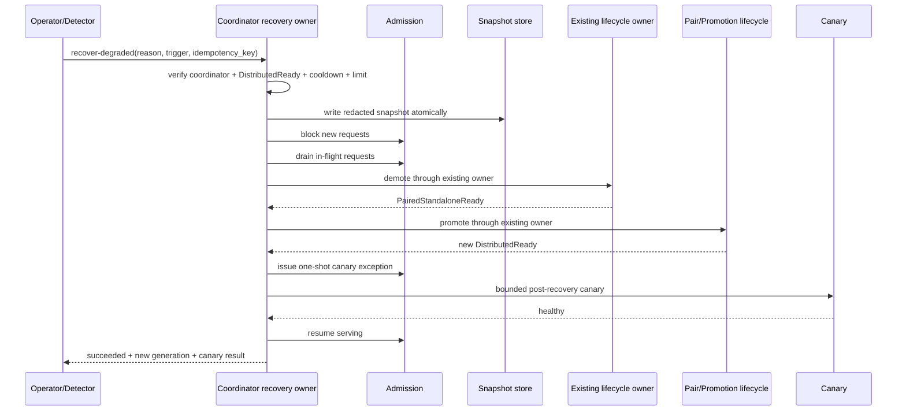

# Throughput Degraded Detection and Recovery Contract v0.3.0

Status: Reviewed and approved for H-02 implementation

この文書は Phase H の後続実装が、閾値・状態遷移・失敗時の安全状態を個別に推測しないための契約である。対象は、`/healthz` と `/readyz` が正常でも実推論の throughput が劣化し、後続 request に低速状態が残る可能性があるケースである。

本契約は、既存の cluster lifecycle owner、admission gate、demotion/promotion、child identity 検証を置き換えない。復旧は coordinator が既存 owner を通じて実行し、worker child への直接 signal、state file の編集、未確認 process の停止を正常経路にしない。

## 1. 用語と既存状態との対応

| 用語 | Siderostat の意味 |
|---|---|
| throughput degradation | process の死活ではなく、active request の prefill/decode 進捗が契約閾値を下回る状態 |
| progress stall | active request で最後の prefill/decode progress event から規定時間更新がない状態 |
| canary | 固定 prompt・固定 token 上限・固定 deadline の、状態を変更しない一回の実推論確認 |
| recovery job | 一つの recovery ID と owner が管理する、検知・snapshot・再構成・canary の一連の処理 |
| Distributed | `StableMode::DistributedLayerParallel`、cluster state は `DistributedReady` |
| Paired Standalone | `StableMode::PairedStandalone`、cluster state は `PairedStandaloneReady` |
| Solo Standalone | `StableMode::SoloStandalone`、cluster state は `SoloStandaloneReady` |
| admission block | 新規 request を受け付けず、既存 request は drain policy に従って扱う状態 |
| safe state | 少なくとも local standalone が利用可能な `SoloStandaloneReady`、または安全に診断・手動復旧へ移れる明示状態 |

`mode` は stable mode、`state` は lifecycle の現在状態、`target` は proxy が request を送る先として区別する。recovery job の phase を cluster `state` の代用にはしない。

## 2. 初期 policy

以下を v0.3.0 の初期値として固定する。設定化は H-08 で行うが、既定値は変更しない。

| policy | 初期値 | 判定上の注意 |
|---|---:|---|
| canary token limit | 64 tokens 以下 | 固定 prompt と組み合わせ、任意 prompt/token 数を受け付けない |
| canary deadline | 30 秒 | HTTP timeout と completion deadline のどちらか早い方で終了 |
| decode lower bound | 5 tokens/s 未満 | active decode の継続サンプルが必要。一回の低 sample だけでは開始しない |
| low TPS sustained duration | 30 秒 | 単一の低 sample や短い揺らぎでは recovery を開始しない |
| progress stall | 60 秒 | active request の最後の progress event から monotonic elapsed で判定 |
| recovery cooldown | 1 時間 | recovery が成功・失敗した時刻から次の自動 recovery を抑制 |
| recovery limit | 12 時間あたり最大 2 回 | recovery ID の開始時刻を基準に bounded history で数える |
| automatic recovery | disabled | `enabled=false` が既定。H-10 の実機 evidence 後に別レビューする |
| recovery admission drain timeout | 60 秒 | throughput recovery 専用。active request を kill せず、超過時は demote/child停止へ進まない |

通常の idle 状態で TPS が 0 であることは異常ではない。`active=false`、request が存在しない、または generation が reset された区間は throughput detector の対象外とする。

### 2.1 timeout の責務分離

既存の通常 lifecycle 用 timeout は変更しない。

| 設定 | 既定値 | 対象 |
|---|---:|---|
| `cluster.timeouts.drain` | 180 秒 | pairing、promotion、demotion、reconnect など通常の cluster-wide drain |
| `cluster.timeouts.stop` | 180 秒 | DS4 child の graceful stop、startup cleanup、graceful runtime restart |
| `recovery.admission_drain_timeout` | 60 秒 | throughput recovery が開始した一時的な admission drain |

`recovery.admission_drain_timeout` は H-08 で typed config として追加する。概念上の設定例は次のとおりであり、H-08 実装前の現行 build がこの項目を読み込むことを意味しない。

```toml
[recovery]
enabled = false
admission_drain_timeout = "60s"
cooldown = "3600s"
max_attempts_12h = 2
```

recovery は開始前にこの timeout を採用し、既存 demotion owner へ operation-scoped deadline として渡す。通常の pairing、promotion、demotion、reconnect は引き続き `cluster.timeouts.drain = 180s` を使用する。DS4 child の停止待ちは常に `cluster.timeouts.stop = 180s` の責務であり、recovery の60秒超過を理由に短縮しない。

canary の prompt は次の非秘密文字列に固定する。呼出元から prompt を差し替えられないようにし、token limit は 64 以下に固定する。

```text
Reply with the single word: OK.
```

canary は Siderostat の local public ingress の `POST /v1/chat/completions` に一回だけ送信する。request body は次の JSON とし、任意 URL、任意 prompt、任意 model、無制限 token を指定する入力は契約に含めない。

```json
{"prompt":"Reply with the single word: OK.","max_tokens":64,"stream":true}
```

### 2.1 Admission block と recovery canary の一時的な例外許可

recovery の `admission block` は、通常の外部からの新規 inference request を一時的に受け付けない状態である。既に実行中の request は強制終了せず、drain policy に従って完了を待つ。外部 request を無期限にキューへ積み続けることは契約に含めない。

drain が完了し、再構成後の cluster が canary 実行可能になった時点でも、通常の外部 request は引き続き block する。recovery owner は、固定 prompt/body の post-recovery canary 一件だけに対して、Siderostat の admission gate を通過できる一回限りの内部許可（recovery canary exception）を発行する。許可の対象は recovery ID、固定 endpoint/body、短い有効期限、一回の使用に限定し、外部 caller が任意の permit を発行・再利用できないようにする。

この例外許可はネットワーク firewall の解除でも、認証済み外部 client の優先権でもない。また ds4-server の request priority、reserved slot、queue bypass を前提にしない。現在の ds4-server は実行可能な job の FIFO scheduling であり、canary を queue の先頭へ割り込ませる機能はない。そのため canary は通常 request の drain 完了後に送信し、未完了 request が残った場合は queue 待ちを成功条件に含めず、drain timeout の契約に従う。

canary が成功基準を満たした場合だけ admission を `serving` に戻す。canary が失敗した場合は外部 request を block したまま、`canary_*` の failure reason とともに手動対応へ移行する。

upstream が SSE を返す場合でも、`siderostat cluster canary --json` の出力は次の bounded JSON に正規化する。`reason` は `healthy`、`deadline`、`http_error`、`low_decode_tps`、`progress_stall` の有限 enumとする。

```json
{
  "status": "healthy",
  "reason": "healthy",
  "elapsed_ms": 1840,
  "ttfb_ms": 120,
  "generated_tokens": 12,
  "chunk_tps": 6.5,
  "http_status": 200
}
```

この結果に prompt、response body、Authorization、API key、session ID、request ID は含めない。

## 3. 検知入力と判定順序

検知器は次の順序で判定する。

1. `active=false` または idle なら `healthy/idle` とし、0 TPS を failure にしない。
2. active で first progress event がまだない場合は `first-token-waiting` として扱い、canary deadline または request 固有の first-token deadline を超えたときだけ failure とする。
3. prefill/decode progress event がある場合は、最後の monotonic timestamp、前回からの token delta、直近 chunk TPS、active elapsed を使う。
4. decode の直近 chunk TPSが 5 tokens/s 未満でも、継続時間または複数 sample の条件を満たさない限り recovery を開始しない。
5. 最後の progress event から 60 秒以上経過した active request は `progress-stall` とする。
6. canary は HTTP error、deadline、低 TPS、progress stall をそれぞれ別の reason code で返す。

wall clock は threshold の経過時間判定に使わない。wall clock は snapshot と job の表示用時刻に限定し、detector の経過判定は monotonic clock とする。

## 4. Recovery API 契約

### 4.1 開始 request

後続の H-06 で loopback admin API に次の endpoint を追加する。

```http
POST /cluster/recover-degraded
Authorization: Bearer <admin-token>
Content-Type: application/json
```

request body は unknown field を拒否する。空 body は `reason=operator` と同義にしない。呼出元は reason を必ず指定する。

```json
{
  "reason": "throughput-degraded",
  "trigger": "manual-canary-failure",
  "idempotency_key": "operator-supplied-unique-key"
}
```

許可する `reason` は `throughput-degraded` とし、`trigger` は `manual-canary-failure`、`progress-stall`、`low-decode-tps`、`first-token-timeout` の有限 enum とする。`idempotency_key` は同じ意図の再送を同じ active job に束ねるために使用する。prompt、response、request body、session ID、任意 URL は受け付けない。

成功時は、処理完了を待たず `202 Accepted` で job snapshot を返す。

```json
{
  "recovery_id": "uuid",
  "operation": "recover-degraded",
  "state": "running",
  "phase": "snapshot",
  "reason": "throughput-degraded",
  "trigger": "manual-canary-failure",
  "owner": "coordinator",
  "started_at": "2026-08-23T00:00:00Z",
  "cluster_generation": 123,
  "idempotency_key": "operator-supplied-unique-key"
}
```

同一の active recovery が存在する場合、二つ目の owner を作らず、既存 job の snapshot を `202 Accepted` で返す。idempotency key が既存の完了 job に一致する場合も、その job の最終 snapshot を返し、再実行しない。

### 4.2 status response

```http
GET /cluster/recover-degraded/{recovery_id}
Authorization: Bearer <admin-token>
```

`state` は `running`、`succeeded`、`failed`、`suppressed` のいずれか、`phase` は次の有限 enum のいずれかとする。

```text
accepted
snapshot
admission_blocked
draining
demoting
paired_standalone
promoting
post_recovery_canary
serving
completed
failed
suppressed
```

完了例:

```json
{
  "recovery_id": "uuid",
  "operation": "recover-degraded",
  "state": "succeeded",
  "phase": "completed",
  "reason": "throughput-degraded",
  "failure_reason": null,
  "started_at": "2026-08-23T00:00:00Z",
  "finished_at": "2026-08-23T00:03:10Z",
  "old_cluster_generation": 123,
  "new_cluster_generation": 124,
  "post_recovery_canary": "healthy",
  "admission": "serving"
}
```

失敗時は `failure_reason` を有限 enumで返す。任意の prompt、response、token、session ID、full deployment ID、secret、完全な model digest は返さない。

### 4.3 CLI 契約

H-06 で次の CLI を追加する。

```sh
siderostat cluster recover-degraded --reason throughput-degraded --trigger manual-canary-failure
siderostat cluster recover-degraded --status <recovery-id>
siderostat cluster recover-degraded --json ...
```

CLI は admin API の client であり、別 supervisor や別 recovery owner を起動しない。認証失敗、role/state gate、duplicate、unknown recovery ID は HTTP/API の reason を保持して表示する。

## 5. Owner、開始 gate、冪等性

recovery job の owner は coordinator の recovery service 一つだけとする。

開始前に全ての gate を確認する。

1. local role が coordinator である。
2. cluster `state` が `DistributedReady`、`mode` が `distributed-layer-parallel` である。
3. active recovery job が存在しない。
4. recovery cooldown を経過している。
5. 12 時間内の recovery 回数が 2 回未満である。
6. current generation、child identity、admission snapshot を取得できる。
7. diagnostic snapshot を atomic write できる。

gate 不成立時は cluster state、admission、child に変更を加えず、`suppressed` または明示的な `failed` を返す。worker、Solo Standalone、Paired Standalone、promotion中、manual intervention中の node は recovery owner になれない。

`idempotency_key`、active owner、recovery ID は独立した duplicate guard とする。job state の read/write は一つの owner lock によって直列化し、二重 demote、二重 snapshot、二重 promotion を許さない。

## 6. 正常な recovery sequence



snapshot が成功するまで admission、cluster state、child process は変更しない。drain 完了後の demote/promotion は既存 lifecycle owner が実行し、recovery service は control protocol や child signal を直接呼ばない。

## 7. Failure contract

| 失敗点 | `state` | admission / target | child と retry | job result |
|---|---|---|---|---|
| 開始 gate不成立 | 変更しない | 変更しない | 実行しない | `suppressed` + reason |
| snapshot write失敗 | 変更しない | 変更しない | 実行しない | `failed(snapshot-write)` |
| recovery admission drain timeout | recovery は `DistributedReady` のまま | generation/target が不変なら admission を `serving` に復元。復元不能なら blocked + manual action | demote、child停止、retryを実行しない。active requestを無条件 killしない | `failed(recovery-drain-timeout)` |
| demote failure | `ManualInterventionRequired` または既存 owner の safe state | local standalone readyなら local target を維持 | restart loopに入らない | `failed(demote-failed)` |
| pairing/promotion failure | `PairedStandaloneReady`、`Backoff`、または `ManualInterventionRequired` | local standalone が使える場合は local target、そうでなければ unavailable | existing promotion backoffを使用。追加 retryを作らない | `failed(promotion-failed)` |
| post-recovery canary timeout/低TPS | 新 generation の stable stateを維持 | admission は servingへ戻さない | recoveryを連続再実行しない。manual interventionへ | `failed(canary-*)` |
| peer loss / identity不一致 | 既存 recovery/lifecycle の safe state | standalone または明示 unavailable | unknown childへ signalしない | `failed(peer-loss/identity-mismatch)` |

表中の `ManualInterventionRequired`、`Backoff`、`SoloStandaloneReady`、`PairedStandaloneReady` は既存 cluster state の値を使う。recovery 専用 stateを cluster state に追加しない。

### 7.1 recovery admission drain timeout の扱い

`recovery.admission_drain_timeout` の60秒は request を強制終了する許可ではない。timeout 時点で recovery は demote と child停止へ進まず、in-flight permit を保持する。recovery が admission 以外の cluster mutation をまだ行っておらず、開始時と同じ generation/target を確認できる場合は、一時的な block を解除して `Serving` に戻し、jobを `failed(recovery-drain-timeout)` とする。generation/target が変化している、または安全に `Serving` へ戻せない場合は blocked のまま manual intervention を要求する。

通常 lifecycle の `cluster.timeouts.drain = 180s` と DS4 child 停止の `cluster.timeouts.stop = 180s` は、この recovery-specific timeout の対象外である。無条件の SIGKILL、state file 削除、OS 再起動はどの timeout 超過でも契約外である。

### 7.2 canary failure の扱い

post-recovery canary が失敗した場合、admission を `serving` に戻さない。新しい child generation が存在していても、推論速度が回復したとはみなさない。既存の安全な standalone または明示 unavailable を維持し、`canary_timeout`、`canary_low_tps`、`canary_progress_stall`、`canary_http_error` を区別する。

## 8. Observability と redaction 境界

recovery log と metrics は recovery ID を相関キーとして使う。ただし recovery ID、PID、session ID、request ID、full deployment ID を metric label に含めない。recovery ID は structured log と status response のみで追跡する。

最低限記録する項目は次のとおりである。

- reason、trigger、owner、phase、result、failure reason
- start/end の wall clock と phase elapsed
- cluster generation、control generation、mode、state、target
- admission state、in-flight count、drain result
- distributed child の PID、generation、起動時刻、identity verification result
- canary の elapsed、TTFB、生成 token 数、chunk TPS、HTTP result
- snapshot path の recovery-scoped identifier と write result

記録してはならない項目は prompt、response body、API key、token、cookie、session ID、request body、完全な deployment ID、完全な model digest、peer proxy token、HMAC secret/signature である。診断に必要な model/binary identity は既存の redacted digest/tag ルールに従う。

### 8.1 H-04 diagnostic snapshot artifact

H-04 の snapshot schema version は `1` とする。snapshot は次の top-level field だけを持つ。

| field | 内容 |
|---|---|
| `schema_version` | snapshot schema version (`1`) |
| `recovery_id` | UUID。保存ディレクトリ名にも使う |
| `captured_at_millis` | snapshot 作成時の wall-clock UNIX epoch ms。threshold 判定には使わない |
| `node_id` | 現在の node の安定識別子 |
| `cluster` | generation、role、mode、state、target、readiness、last failure |
| `control_session` | control generation、phase、role、lease、redacted peer descriptor、peer distributed child generation |
| `admission` | state、in-flight、capacity、drain generation |
| `children` | managed child の PID、profile、generation、running、readiness |
| `process` | managed child 数と running child 数。実行ファイル path/argv は含めない |
| `progress` | aggregate in-flight、prefill/generation の active、progress observed、age、token delta、current/average TPS |
| `network` | interface 名だけ。IP、route、secret は含めない |
| `os` | OS family、OS、architecture |

数値が未取得の場合は `null` とし、偽の `0` や空文字で代替しない。progress age は既存の
monotonic freshness state から取得する。snapshot 自体の wall clock は表示・相関用に限る。

保存先は次の user-scoped directory とする。

```text
~/Library/Application Support/siderostat/recovery/snapshots/<recovery-id>/snapshot.json
```

親ディレクトリと recovery directory は `0700`、`snapshot.json` は `0600` とする。temporary
file は同一 recovery directory 内で作成し、write、file sync、atomic rename、directory sync
の順で保存する。write または sync に失敗した場合、最終 `snapshot.json` を成功扱いにしない。

保持数の初期値は最新 8 snapshot とする。pruning は recovery snapshot root 配下の、schema
version 1 として正常に読める UUID directory だけを対象にし、古い順に recovery directory 単位で
削除する。未知のファイル・ディレクトリは削除しない。この保持数は H-04 のユーザーレビュー
対象であり、レビュー完了までは v0.3.0 の初期実装値として扱う。

## 9. 実装順序と release gate

| task | 契約から受け取るもの | 完了条件 |
|---|---|---|
| H-02 | progress event、monotonic age、idle/first-token semantics | metrics unit/render test が全状態を区別 |
| H-03 | `prefill-chunk-tps`、`generation_chunk_tps`、progress age | monitorが古い値を現在値として表示しない |
| H-04 | snapshot schema、redaction、保存先、permission、retention | atomic write/forbidden key/retention test |
| H-05 | 固定 canary と reason code | fake DS4で正常・timeout・低TPS・stall・HTTP errorを区別 |
| H-06 | recovery API、owner、job history、duplicate policy、operation-scoped drain deadline | auth、role/state、duplicate、stale ID、snapshot failure test |
| H-07 | 正常 sequence と failure contract、timeout rollback | 既存 demote/promotion owner を用いた2 node fake test |
| H-08 | disabled default、cooldown、回数上限、安全弁 | deterministic-time detector test |
| H-09 | H-02〜H-08 の一括 gate | suiteを固定 sleepなしで10回実行 |
| H-10 | 実機 change window と rollback | manual/opt-in automatic recoveryを各1回、`enabled=false`復帰 |

H-10 の実機 evidence と operator review が終わるまで、自動復旧の既定値は `false` のままとする。H-10 後に既定値を変更する場合は、別の設計・レビュー・release gateを要求する。

## 10. Hermes handoff の暫定値

Hermes 側の `HERMES_API_CALL_STALE_TIMEOUT=1800` と Siderostat 側の `first_body_byte=2400s`、`stream_idle=2400s` は、今回の recovery contract の throughput threshold ではない。これは呼出元と proxy の deadline 順序を確保する暫定運用値であり、正常性判定は canary と progress metrics が担う。

cron 前には、同じ Siderostat endpoint に対して canary を一回実行する。canary が成功したときだけ本来の cron を開始し、失敗時には recovery job の status と operator action を確認する。Hermes の stale retry を recovery owner の代替にしない。

## 11. Acceptance matrix

| 入力/状態 | 期待する判定 | cluster/admission の変更 |
|---|---|---|
| idle、TPS=0 | healthy/idle | なし |
| 短い正常 request | healthy | なし |
| first progress 前、deadline内 | first-token-waiting | なし |
| first-token deadline超過 | `first-token-timeout` | manual recovery時のみ契約sequenceへ |
| decode低TPSの単一sample | observeのみ | なし |
| decode低TPSの継続条件成立 | `low-decode-tps` | start gate通過後のみ recovery |
| progress 60秒停止 | `progress-stall` | start gate通過後のみ recovery |
| canary HTTP 5xx/timeout | `canary-http-error` / `canary-timeout` | recovery後は servingへ戻さない |
| cooldown中 | suppressed | なし |
| 12時間内2回実施済み | suppressed | なし |
| active recovery中の再要求 | 同じ recovery ID | 二重 ownerを作らない |
| coordinator以外からの開始 | rejected | なし |
| DistributedReady以外からの開始 | suppressed/rejected | なし |
| recovery admission drain timeout | failed | demote/child停止なし。generation/target不変なら admission を serving に戻す |
| snapshot write failure | failed | 変更前の状態を維持 |

この matrix と failure table は H-02〜H-10 の実装・テスト・実機受入の共通判定表とする。
